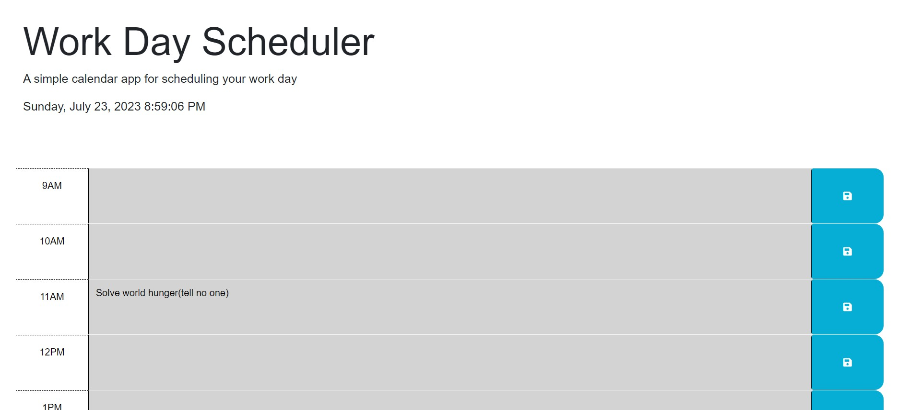
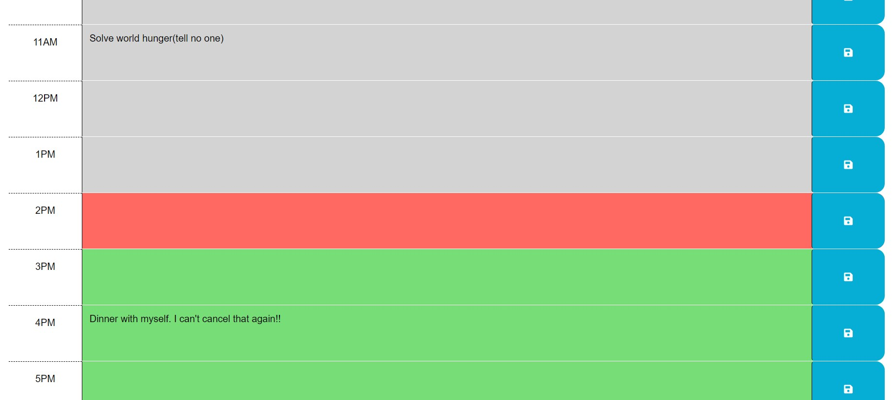

# <Your-Project-Title>

## Description

- I was hoping this assignment could help me get familiarized with jQuery. I felt like we had focused just enough to learn about 3rd party APIs, but not enough to practice/master them, which I was hoping to get more hands on approach with them on this assignment.

- I learned the ins and outs of jQuery with this one. jQuery feels very similar to interacting with the Web API, just simplified and streamlined. I noticed jQuery let me do stuff in a single line, that would probably would have taken me dozens of new lines in traditional JS to complete. jQuery also took me a minute to get used to its quirks, and through much experimentation(and documentation diving) I was able to work out how specific things work. At first it was frustrating as I wasnt used to the fact that jQuery does most of its things with extra functions/methods, and I was so used to working with the DOM manually through the web API the last few weeks, that it through me off a bit and I had to readjust how my head went around it. All in All I am impressed by how powerful jQuery seems to be, especially when it comes to manipulating the DOM.
- Documentation Diving is still a bit hard for me but I was bale to find lots of useful stuff by digging through the day.js and jQuery documentations. I'm grateful stuff like this exist and I wonder how much of textbook searching one had to do when learning programming languages 35 - 40 years ago.

## Usage

You can use this tool to quickly keep your current day organized. Events are listed by hour, from top to bottom, starting with 9AM and ending with 5PM. Each row on the table represents an hour of the day. The current time is displayed at the top of the page. As the day progresses, the rows will change colors: gray if the hour is in the past, red if the hour is currently happening, and green if the hour has not arrived yet. The page has to be refreshed in order to see the updated color changes as the day progresses.

- This is determined on page load, which compares each row block to the current time, and updates its styling accordingly. You can test this in JS on line 45, by changing currentHour = 12; and reload the page. This will show 12pm as the current hour(red), every hour before that gray, and all hours in the future, green. It checks against 24 hour time, so if you change it to 2, it will consider it as hour 02 or 2:00AM. if you change it to 14, it will consider it as hour 14 or 1400 military time/2:00PM normal time.

To save an event/meeting to your schedule, type in some brief info in the textbox in the center for the respective hour, and click the save button on the right side. Your events will persist if you leave/close the page(just dont reset your cache or do a hard reset). Once an event is complete, you can remove it by deleting the text from the respective text box and clicking the save button again.

Link to the deployed webpage can be found here:

[https://jrapich.github.io/work-day-scheduler/](https://jrapich.github.io/work-day-scheduler/)

Link to the repository can be found here:

[https://jrapich.github.io/work-day-scheduler/](https://jrapich.github.io/work-day-scheduler/)

Here are some screenshots:

[Screenshot 1](./assets/images/screenshot-01.jpg)

[Screenshot 2](./assets/images/screenshot-02.jpg)

## Credits

Here is the source/starter original code for the assignment. HTML and CSS is 99% the same as original.
https://github.com/coding-boot-camp/crispy-octo-meme

Fellow bootcamp students Jalen, Eden, Anna; we figured out how to display and update the current time on the page together after one 
of our classes

For a bit I got stuck on these jquery functions, and couldn't understand what each was doing: val() only works on inputs(forms, textarea, etc) where text() does not. I was also trying to grab the value of stuff with .value and .textContent but was just struggling really hard. This stackoverflow link was the "lightbulb" moment for me and helped me immensely in figuring the rest out:
https://stackoverflow.com/questions/807867/difference-between-val-and-text

## License

This project protected under MIT license. For more info, see [License](./LICENSE)

---